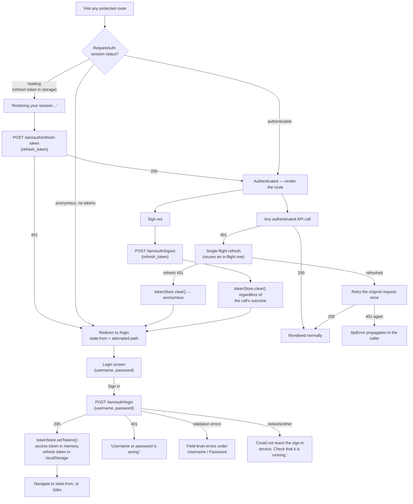

# Authentication and session

Auth runs against a separate origin IAM service, from every AI
feature, but shares one token: the IAM service issues the JWT, the AI
service validates it with the same public key.

## Details

- **Session bootstrap.** On load, `SessionProvider` starts `authenticated` if an access
  token is already in memory, `loading` if only a refresh token survives in
  `localStorage` (a page reload), or `anonymous` otherwise.
- **Single-flight refresh.** `refreshAccessToken()` keeps a module-level in-flight
  promise; concurrent 401s from different requests all await the same refresh rather than
  each starting their own. On a genuine 401 from the refresh call itself, the refresh
  token is cleared; on a network error it's left alone so a later retry can still succeed.
- **Retry-once.** `createClient()`'s `onUnauthorized` hook (wired to `refreshAccessToken`)
  fires on any 401, awaits the refresh, and retries the original request exactly once
  (`isRetry` prevents a second loop). The refresh call itself is made on a client with no
  `onUnauthorized`, so it can never recursively trigger another refresh.
- **`RequireAuth`** is the only route guard: `loading` → a plain restoring message,
  `anonymous` → redirect to `/login` with `state.from` so the login screen can send the
  user back to what they were trying to reach, otherwise render the protected route.
- **Logout always clears local state** in a `finally`, even if the `POST
  /iam/auth/logout` call fails — a stuck server-side session shouldn't leave the client
  looking logged in.
