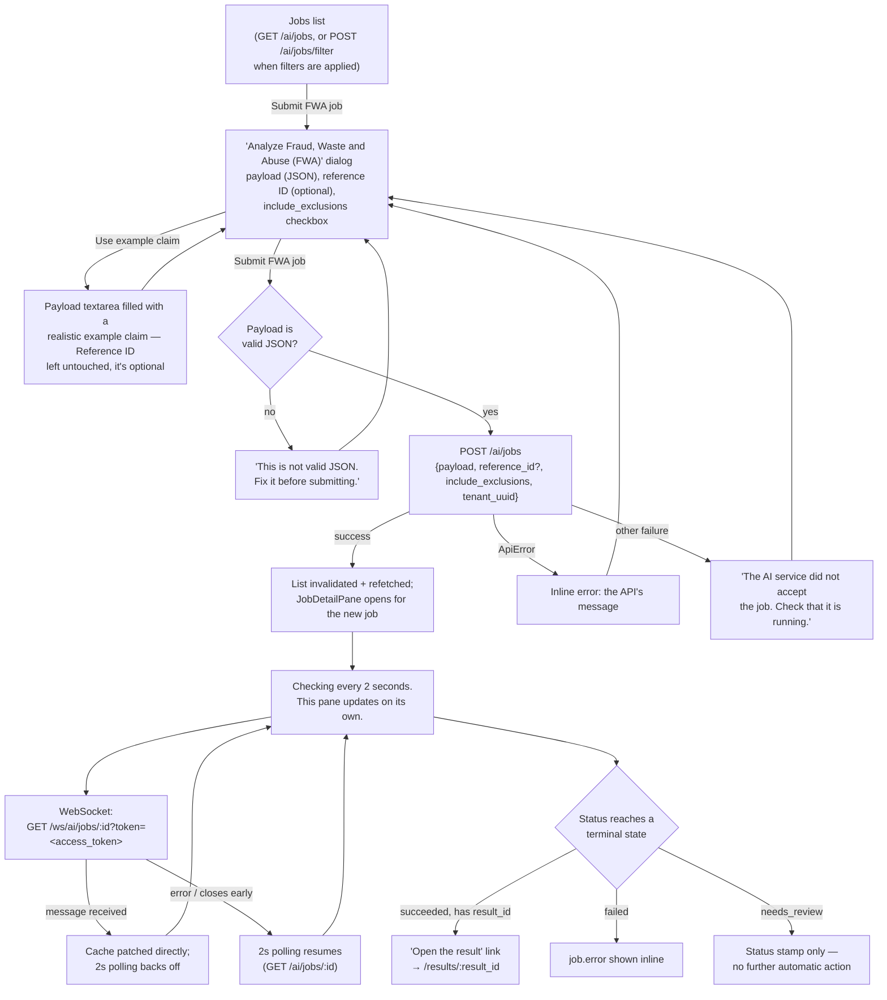

# FWA jobs

Submitting and watching a Fraud/Waste/Abuse (FWA) analysis job — the app's most-watched
async flow, and the shape every other "start a job" flow in this app follows.

## Details

- **The dialog's title reads "Analyze Fraud, Waste and Abuse (FWA)"**; the button that
  opens it and the submit button both still read "Submit FWA job" — the title was renamed
  for clarity without touching the action language (the brief's "an action keeps its name
  end to end" rule applies to the button, not necessarily a longer descriptive heading).
- **Reference ID is optional and doesn't need to match anything.** If it happens to
  resolve to a real claim already on file, the backend reads that claim's own data and
  ignores the typed payload; if it doesn't resolve, the typed payload is used as-is. There
  is no claim list in this UI to pick one from, which is why the field stays free-text
  and unrequired rather than a picker.
- **"Use example claim"** only fills the payload — a realistic claim shape matching what
  the backend itself builds from a real record (diagnosis/procedure codes, amounts,
  dates) — specifically so someone with no claim data on hand can see a working shape.
  It never touches Reference ID, since filling that with a made-up value would misrepresent
  the example as tied to a real claim.
- **WebSocket-first, polling always as a safety net.** `usePollingJob` opens the socket
  and the polling query at the same time. The socket is an accelerator: while it's
  delivering messages, `refetchInterval` returns `false` so the job isn't fetched twice.
  If the socket never connects, errors, or closes before a terminal status, polling was
  never actually turned off and picks the slack back up automatically — no user-visible
  difference either way beyond the fresher update cadence.
- **Getting to the result.** A `result_id` on a succeeded job is the only link into the
  [Results](./10-results.md) flow — there's no other way to browse to a specific result
  from a job.
