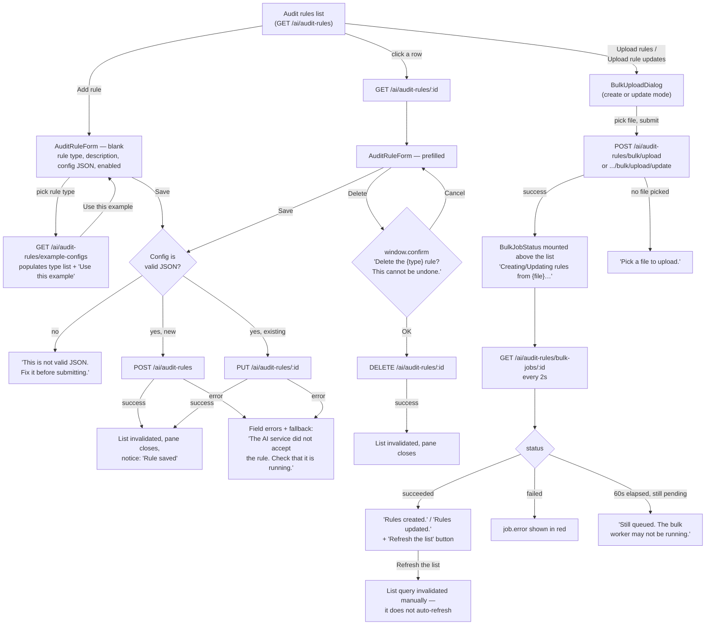

# Audit rules

Rules can be managed one at a time or in bulk via CSV/XLSX upload. Both paths write to the
same list.

## Details

- **The example-config shortcut only appears once a rule type is picked**, and only if
  that type actually has an `example` — it fills the config textarea, it doesn't submit.
- **Delete is edit-mode only** — there's no delete affordance from the blank/create form,
  and no bulk-delete path.
- **The bulk tracker's 60-second cap** exists because the upload jobs run in a separate
  worker process that may not be running at all; past that cap without a terminal status,
  the UI says so explicitly rather than spinning forever.
- **A successful bulk job does not auto-refresh the list** — "Refresh the list" is a
  deliberate manual action, not an oversight; the invalidate-on-success pattern used
  elsewhere (single-rule save) doesn't apply here because the bulk job is a *count*, not
  a returned row the page already has in hand.
