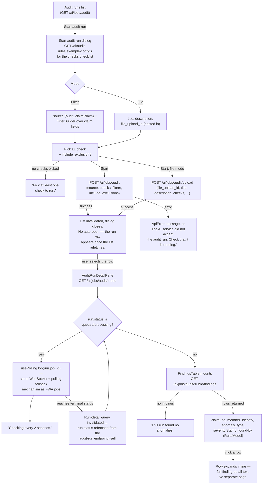

# Audit runs

Running a rule set (and/or the model) against a batch of claims, watching it complete,
then reading what it found.

## Details

- **Two ways to define the input batch**: a filter over claim fields (built with the same
  [`FilterBuilder`](../design/2026-09-12-ai-console-design-brief.md) used on the Jobs
  list), or a pre-uploaded file referenced by `file_upload_id` — that upload itself
  happens outside this flow.
- **No auto-open of the new run.** Starting a run returns a *job*, not a run row with an
  id the UI already knows how to open; the new row surfaces once the list invalidates and
  refetches, and the user picks it manually.
- **The run's own status and the underlying job's status are two different reads.**
  `usePollingJob` watches the job; once that job goes terminal, the run-detail query is
  invalidated so the *run* record (which the findings table depends on) gets refetched
  from its own endpoint rather than assumed from the job's status.
- **Findings have no drill-down page** — clicking a row expands it in place. There's
  nothing to navigate to beyond the detail text already returned with the row.
