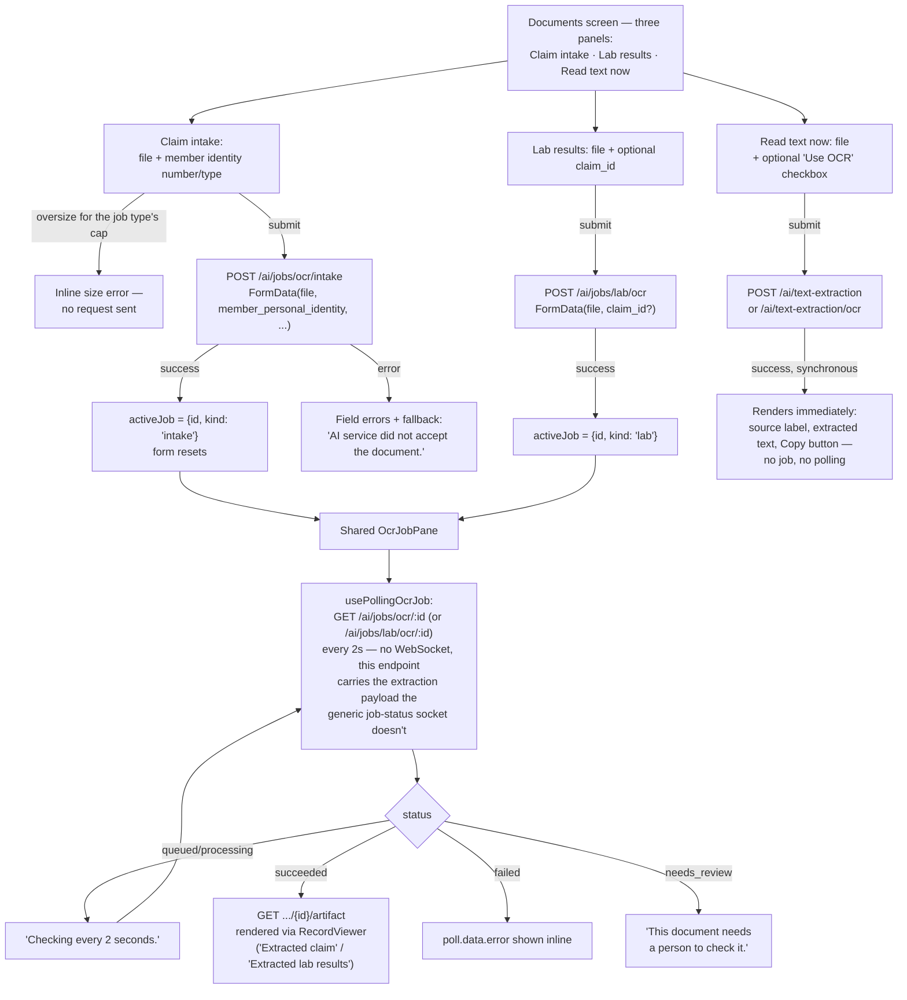

# OCR document intake

Three panels on one screen, sharing a single `activeJob` slot so only one job's status
pane shows at a time.

## Details

- **File-size caps are shown before upload**, sourced from `GET /ai/jobs/types` per job
  type, so an oversized file is rejected client-side rather than after a slow upload.
- **The artifact fetch is gated on `succeeded`** — it isn't attempted for `failed` or
  `needs_review`, since there's nothing structured to show yet (or ever, for a failure).
- **"Read text now" is the odd one out**: no job is created at all, the extraction is
  synchronous and the result renders on the same request/response.
