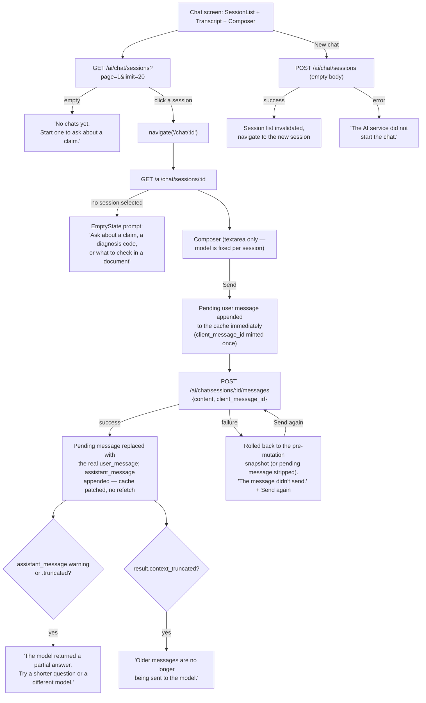

# Chat

A single non-streaming response per message, with an optimistic send and idempotent retry.

## Details

- **Not streamed.** `sendSessionMessage` resolves once with the complete result; there is
  no token-by-token rendering.
- **`client_message_id` is minted once per submission** and reused verbatim on "Send
  again," so a retry after a network failure can't create a duplicate message
  server-side.
- **The session list doesn't refresh after sending a message** — only "New chat" (session
  creation) invalidates it. A session's `last activity` in the sidebar can lag behind
  what's actually in its transcript until the user navigates away and back.
- **The model is fixed per session** (shown in the session list), not chosen per message —
  there's no model/provider picker in the composer itself.
