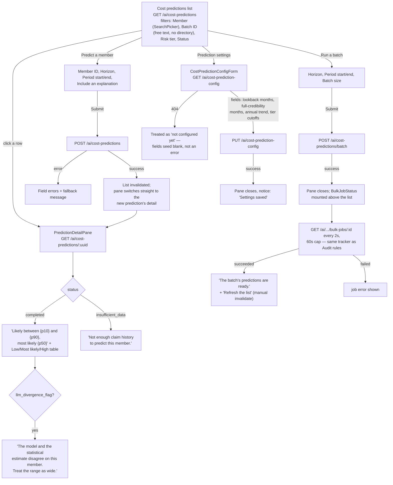

# Cost predictions

One member at a time, a whole book at once, or the config that shapes every prediction's
risk-tier cutoffs.

## Details

- **Member is a `SearchPicker`, Batch ID is free text.** There's a member directory to
  search against (`searchMembers`); there's no equivalent directory for batch ids, so that
  field keeps the draft/commit-on-Enter-or-blur pattern instead.
- **A 404 on the config endpoint means "nothing saved yet," not a failure** — the form
  opens with blank fields and the first save is effectively a create, same 404-as-empty
  convention as the [budget](./08-budget.md) flow.
- **`insufficient_data` suppresses the figures block entirely** rather than showing
  zeroed-out numbers — a "no answer" is shown as no answer, not a misleading zero.
- **The batch tracker is the same `BulkJobStatus` component** used by Audit rules' bulk
  upload — one shared tracker, reused wherever a job produces a count rather than a single
  row.
