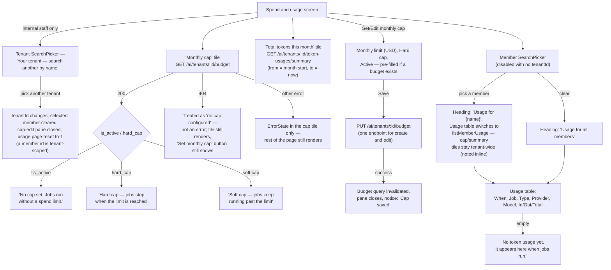

# Budget / spend & usage

The monthly cap, tenant-wide token totals, and a per-member usage table — three related
but independently-scoped pieces of the same screen.

## Details

- **The 404-means-nothing-configured-yet pattern reappears here**: a budget 404 shows the
  no-cap copy and keeps the "Set monthly cap" action available, rather than treating a
  fresh tenant's lack of a budget as an error state.
- **Any other budget-fetch failure stays scoped to that one tile.** `ErrorState` replaces
  just the cap tile's contents; the summary tile, the member picker, and the usage table
  all keep working — a real fix for an earlier bug where any non-404 failure blanked the
  entire page.
- **Switching tenants resets the member filter.** A member id only means something within
  the tenant it was searched in; carrying it across a tenant switch would silently scope
  the usage table to a member from the wrong tenant.
- **The usage endpoints don't return the app's usual pagination envelope.** They answer
  `{data: {items, total}}` instead of `{data: [...], _metadata: {pagination}}` — the
  client reshapes this (`toUsagePage()` in `budget/api.js`) into the standard shape before
  it reaches the table, computing `total_pages` from `total`/`page_size` since the backend
  doesn't send it.
