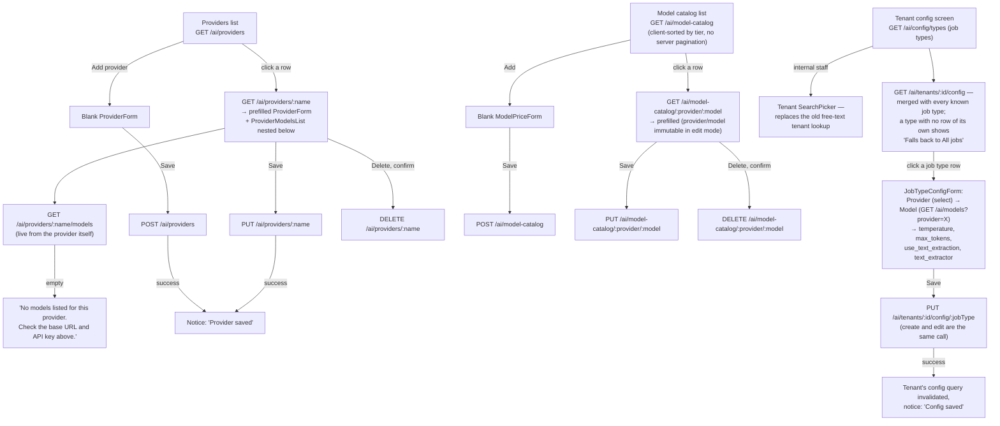

# Admin setup: providers, model catalog, tenant config

The platform-admin layer: register an LLM provider, price its models, then point a
tenant's job types at a provider/model/temperature combination.

## Details

- **A provider's models are nested in its own edit pane**, not a separate screen — you
  can't manage a provider's model list without first opening that provider.
- **`api_key` never round-trips.** The field always starts blank; leaving it blank on
  save omits it from the request entirely so an existing key is preserved ("Leave blank
  to keep the current key.").
- **The model-catalog list has no server-side pagination or sort** — it fetches
  everything and sorts by tier client-side, unlike every other list in the app.
- **A stale saved provider/model still shows as an option** in the tenant config form even
  if it's since dropped out of the live provider/model lists, so the form never silently
  "loses" what's actually configured.
- **"All jobs" is a real row, not a UI label** — every tenant has (or can have) a
  job-type row named `all` that every other job type without its own row inherits at
  runtime. There's no explicit "remove override" action; the only way back to the
  fallback is presumably re-pointing that specific job type's row, which this form
  doesn't expose as a delete.
