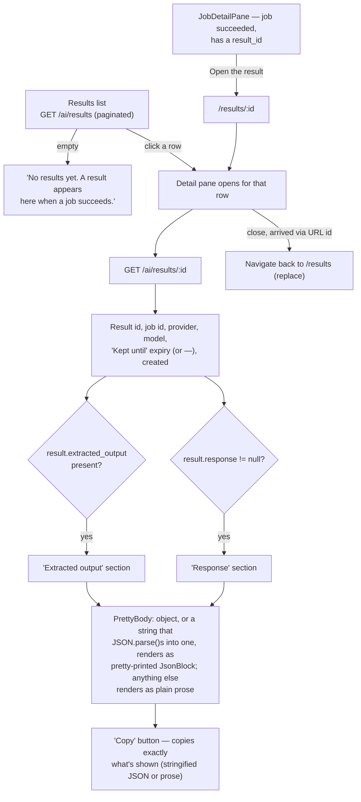

# Results

Where a succeeded job's output actually lives, and the one place raw model/tool output
gets rendered for a human to read.

## Details

- **Arriving from a job is the common path** — a `result_id` on a succeeded job is the
  only in-app link into this screen; there's no other cross-reference from, say, an audit
  finding or a chat message.
- **Deep-linking works both ways**: `/results/:id` seeds the detail pane directly from the
  URL even before any row is clicked in the list, and closing a pane that was opened this
  way navigates back to the bare `/results` list rather than leaving a stale id in the URL.
- **`PrettyBody`'s object-detection is the whole point of the component**: a response
  that's already a JS object, or a JSON-shaped string, is read as a record and
  pretty-printed; anything else — including a string that merely looks like JSON but
  fails to parse — falls back to prose. This is the exact bug surface fixed earlier
  (`String(object)` producing `[object Object]`) and the flow now handles both shapes on
  purpose.
